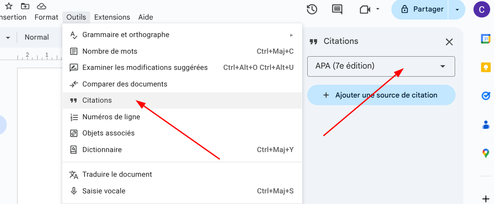
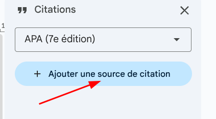

# Comment citer en suivant les normes APA dans votre TPC/TM en utilisant Google Docs

## Tout d'abord les normes APA, c'est quoi ?

Regardez cette vidéo pour comprendre les normes APA (Source : Sem/DIP):

  <iframe width="560" height="315" 
    src="https://www.youtube.com/embed/3iG9YkeuIVU" 
    title="YouTube video player" 
    frameborder="0" 
    allow="accelerometer; autoplay; clipboard-write; encrypted-media; gyroscope; picture-in-picture; web-share" 
    allowfullscreen>
  </iframe>

Pour résumer, les normes APA sont un ensemble de règles pour citer des sources dans les travaux académiques. Elles sont utilisées pour donner crédit aux auteurs des sources que vous utilisez dans votre travail et pour permettre à vos lecteurs de trouver ces sources s'ils souhaitent en savoir plus.

Les normes APA couvrent la manière de formater les citations dans le texte, ainsi que la manière de créer une bibliographie à la fin de votre document. Dans les normes APA, les citations dans le texte incluent généralement le nom de l'auteur et l'année de publication de la source, tandis que la bibliographie à la fin du document fournit des informations plus détaillées sur chaque source citée, telles que le titre de l'œuvre, le nom de l'éditeur, et d'autres détails pertinents.

Il faut donc éviter d'utiliser les notes de bas de page pour citer vos sources, car les normes APA privilégient les citations dans le texte et une bibliographie à la fin du document.

---

## Pourquoi Google Docs ?

Google Docs incorpore un outil de citation qui facilite la création de bibliographies et de citations dans différents styles, y compris les normes APA. C’est donc le logiciel qui garantit que vos citations et votre bibliographie respectent la norme. En utilisant Google Docs, vous pouvez facilement insérer des citations dans votre travail et générer automatiquement une bibliographie à la fin de votre document.

De plus, Google Docs est gratuit et accessible à tous, ce qui en fait un choix populaire pour les étudiants et les professionnels qui ont besoin de créer des documents avec des citations, sans avoir à investir dans des logiciels coûteux.

Dernier point, mais non des moindres, Google Docs permet une collaboration en temps réel, ce qui est particulièrement utile pour les projets de groupe.
Il est également pratique pour partager votre travail avec votre professeur, afin qu’il puisse suivre votre progression et vous donner des conseils en temps réel.

---

## Résumé : comment citer en suivant les normes APA dans Google Docs ?

1. Ouvrez votre document Google Docs.
2. Cliquez sur "Outils" dans la barre de menu, puis sélectionnez "Citations".
3. Choisissez le style de citation "APA" dans le menu déroulant en haut du panneau de citations.
4. Dans le panneau de citations qui s'ouvre à droite, cliquez sur "Ajouter une source".
5. Choisissez le type de source que vous souhaitez citer (livre, article de journal, site web, etc.).
6. Remplissez les champs requis pour la source que vous souhaitez citer (auteur, titre, date de publication, etc.). Pour les livres, vous pouvez aussi utiliser le champ ISBN pour remplir automatiquement tous les autres champs. Vous trouverez l'ISBN au dos de votre livre ou dans des bases de données. Amazon.fr est particulièrement pratique pour trouver l'ISBN. Pour les sites web, vous pouvez utiliser le champ "URL" pour remplir automatiquement les champs "Titre" et "Date de publication". Assurez-vous de vérifier que les informations sont correctes et complètes, car cela affectera la précision de votre citation (souvent, il est nécessaire d'effacer le champ "Auteur", par exemple).
7. Cliquez sur "Ajouter la source" pour enregistrer la source dans votre bibliothèque de citations.
8. Pour insérer une citation dans votre document, placez le curseur à l'endroit où vous souhaitez insérer la citation. Sélectionnez la source que vous souhaitez citer dans la liste de votre bibliothèque de citations, puis cliquez sur "Insérer la citation" dans le panneau de citations.
9. Google Docs insérera automatiquement la citation dans le format APA approprié dans votre document.
10. Pour générer une bibliographie à la fin de votre document, placez le curseur à l'endroit où vous souhaitez insérer la bibliographie, puis cliquez sur "Insérer la bibliographie" dans le panneau de citations. Google Docs générera automatiquement une bibliographie formatée selon les normes APA avec toutes les sources que vous avez citées dans votre document.
11. Pour les images, nous recommandons une approche simplifiée adaptée aux TPC/TM : citer dans une légende sous l'image (par exemple, "source : [nom du site web ou de la source]"), ou alors si c'est une œuvre d'art, vous pouvez citer l'artiste et la date de production. Vous pouvez vérifier avec votre maître accompagnant si cette méthode lui convient.

---

## Instructions détaillées pour citer en suivant les normes APA dans Google Docs

**Table des matières :**

    - [1. Accéder au menu citation](#1-accéder-au-menu-citation)
    - [2. Citer un livre](#2-citer-un-livre)
    - [3. Citer un site web](#3-citer-un-site-web)
    - [4. Citer un article de journal (académique ou presse)](#4-citer-un-article-de-journal-académique-ou-presse)
    - [5. Insérer une citation dans votre texte](#5-insérer-une-citation-dans-votre-texte)
    - [6. Insérer la bibliographie finale](#6-insérer-la-bibliographie-finale)
    - [7. Conseils supplémentaires et erreurs courantes à éviter](#7-conseils-supplémentaires-et-erreurs-courantes-à-éviter)
    - [8. Cas particulier : citer les images et illustrations](#8-cas-particulier--citer-les-images-et-illustrations)

---

### 1. Accéder au menu citation

Pour commencer à citer vos sources dans Google Docs, vous devez d'abord accéder au menu de citations :

1. Ouvrez votre document Google Docs
2. Dans la barre de menu en haut de la page, cliquez sur **"Outils"**
3. Dans le menu déroulant qui s'affiche, sélectionnez **"Citations"**
4. Un panneau s'ouvrira sur le côté droit de votre document

Une fois le panneau ouvert, assurez-vous de sélectionner **"APA"** dans le menu déroulant en haut du panneau pour que toutes vos citations suivent automatiquement les normes APA.

---

### 2. Citer un livre

Pour ajouter un livre à votre bibliothèque de citations :

1. Dans le panneau de citations à droite, cliquez sur le bouton **"+ Ajouter une source de citation"**
2. Dans la fenêtre qui s'ouvre, sélectionnez **"Livre"** dans le menu déroulant "Type de source"
3. Remplissez les champs suivants :
   - **Auteur(s)** : Nom, Prénom de l'auteur (exemple : Dupont, Jean)
   - **Titre** : Le titre complet du livre en italique
   - **Éditeur** : La maison d'édition
   - **Date de publication** : L'année de publication
   - **Ville de publication** : La ville où le livre a été publié (optionnel selon la version APA)

**Astuce pratique** : Si vous avez l'ISBN du livre (trouvé au dos du livre ou sur des sites comme Amazon.fr), vous pouvez le saisir dans le champ **"ISBN"**. Google Docs remplira alors automatiquement la plupart des champs. **Attention** : vérifiez toujours que les informations sont correctes et complètes, car le remplissage automatique peut parfois contenir des erreurs ou des informations superflues (notamment dans le champ "Auteur" où le nom du site web peut apparaître).

4. Une fois tous les champs remplis, cliquez sur **"Ajouter la source de citation"**

Le livre est maintenant enregistré dans votre bibliothèque de citations et prêt à être inséré dans votre document.

**Exemple de résultat** : Dans le texte, la citation apparaîtra comme suit : (Dupont, 2020). Dans la bibliographie : Dupont, J. (2020). *Titre du livre*. Maison d'édition.

---

### 3. Citer un site web

Pour citer un site web dans votre document :

1. Dans le panneau de citations, cliquez sur **"+ Ajouter une source de citation"**
2. Sélectionnez **"Site Web"** dans le menu déroulant "Type de source"
3. Remplissez les champs suivants :
   - **URL** : Copiez-collez l'adresse complète de la page web
   - **Titre** : Le titre de la page web ou de l'article
   - **Auteur(s)** : Le nom de l'auteur si disponible (sinon, laissez vide ou indiquez le nom de l'organisation)
   - **Date de publication** : La date de publication ou de dernière mise à jour (si disponible)
   - **Date de consultation** : La date à laquelle vous avez consulté le site (important pour les sources en ligne qui peuvent changer)

**Astuce pratique** : Lorsque vous saisissez l'URL, Google Docs peut automatiquement récupérer le titre et la date de publication. Cependant, il est **crucial** de vérifier ces informations, car elles sont souvent incomplètes ou incorrectes. En particulier :

- Supprimez le nom du site web dans le champ "Auteur" si ce n'est pas pertinent
- Vérifiez que le titre correspond bien au contenu de la page
- Ajoutez la date de consultation si elle n'est pas automatiquement remplie.

4. Cliquez sur **"Ajouter la source de citation"**

**Exemple de résultat** : Dans le texte : (Nom de l'auteur ou de l'organisation, 2021). Dans la bibliographie : Nom de l'auteur. (2021). *Titre de la page*. Nom du site. URL

---

### 4. Citer un article de journal (académique ou presse)

Pour citer un article de journal académique ou de presse :

1. Dans le panneau de citations, cliquez sur **"+ Ajouter une source de citation"**
2. Sélectionnez **"Article de journal"** dans le menu déroulant
3. Remplissez les champs suivants :
   - **Auteur(s)** : Nom, Prénom de(s) l'auteur(s)
   - **Titre de l'article** : Le titre complet de l'article
   - **Titre du journal** : Le nom du journal ou de la revue
   - **Volume** : Le numéro du volume (pour les revues académiques)
   - **Numéro** : Le numéro de l'édition (pour les revues académiques)
   - **Pages** : Les numéros de page (exemple : 45-67)
   - **Date de publication** : L'année, le mois et/ou le jour de publication
   - **URL ou DOI** : L'adresse web ou le Digital Object Identifier (pour les articles en ligne)

**Pour un article de revue académique** : Le DOI (Digital Object Identifier) est préférable à l'URL car il est permanent. Vous le trouverez généralement sur la première page de l'article ou sur la page web de la revue.

**Pour un article de presse** : Indiquez l'URL de l'article et la date de consultation.

4. Cliquez sur **"Ajouter la source de citation"**

**Exemple de résultat (revue académique)** : Dans le texte : (Martin & Lefèvre, 2019). Dans la bibliographie : Martin, P., & Lefèvre, S. (2019). Titre de l'article. *Nom de la Revue*, *32*(4), 45-67. https://doi.org/10.xxxx/xxxxx

**Exemple de résultat (article de presse)** : Dans le texte : (Bernard, 2022). Dans la bibliographie : Bernard, M. (2022, 15 mars). Titre de l'article. *Le Monde*. URL

---

### 5. Insérer une citation dans votre texte

Une fois que vous avez ajouté vos sources à votre bibliothèque de citations, vous pouvez les insérer dans votre document :

1. **Placez votre curseur** à l'endroit exact où vous souhaitez insérer la citation dans votre texte
   - Généralement, la citation se place juste après l'information que vous souhaitez référencer
   - Elle doit être placée **avant** le point final de la phrase

2. Dans le panneau de citations à droite, **recherchez la source** que vous souhaitez citer
   - Vous pouvez utiliser la barre de recherche si vous avez beaucoup de sources
   - Ou faire défiler la liste de vos sources

3. **Cliquez sur la source** que vous souhaitez citer

4. Cliquez sur le bouton **"Insérer"** (ou "Citer") à côté de la source

5. Google Docs insère automatiquement la citation au format APA : **(Nom de l'auteur, année)**

**Important** : Si vous citez plusieurs fois la même source dans votre document, répétez simplement cette procédure. Google Docs gardera la trace de toutes vos citations pour la bibliographie finale.

**Exemple dans le texte** : 
> Selon les recherches récentes (Dupont, 2020), l'utilisation des normes APA facilite la lecture académique.

---

### 6. Insérer la bibliographie finale

La dernière étape consiste à générer automatiquement votre bibliographie à la fin de votre document :

1. **Allez à la fin de votre document** ou à l'endroit où vous souhaitez insérer la bibliographie
   - Créez une nouvelle page si nécessaire (Insertion > Saut > Saut de page)
   - Ajoutez un titre **"Bibliographie"** ou **"Références"** (centré ou aligné à gauche selon vos préférences)

2. **Placez votre curseur** sous le titre de la bibliographie (sur une nouvelle ligne)

3. Dans le panneau de citations à droite, cliquez sur le bouton **"Insérer la bibliographie"** (généralement situé en bas du panneau)

4. Google Docs génère automatiquement une bibliographie complète de toutes les sources que vous avez citées dans votre document
   - Les sources sont automatiquement classées par ordre alphabétique
   - Le formatage APA est appliqué automatiquement (retraits, italiques, etc.)
   - Seules les sources effectivement citées dans le texte apparaissent dans la bibliographie

**Mise à jour automatique** : Si vous ajoutez de nouvelles citations à votre document, la bibliographie se mettra automatiquement à jour. Si elle ne se met pas à jour, cliquez (droit) sur la bibliographie, puis sélectionnez « Actualiser ».

**Exemple de bibliographie** :

> **Bibliographie**
>
> Bernard, M. (2022, 15 mars). Titre de l'article. *Le Monde*. https://www.lemonde.fr/article
>
> Dupont, J. (2020). *Titre du livre*. Maison d'édition.
>
> Martin, P., & Lefèvre, S. (2019). Titre de l'article. *Nom de la Revue*, *32*(4), 45-67. https://doi.org/10.xxxx/xxxxx

---

### 7. Conseils supplémentaires et erreurs courantes à éviter

**✓ À faire :**

- Vérifiez toujours les informations auto-remplies par Google Docs (surtout pour les ISBN et URL)
- Citez au fur et à mesure de votre rédaction plutôt qu'à la fin
- Gardez vos sources organisées dans le panneau de citations
- Relisez votre bibliographie finale pour détecter d'éventuelles erreurs de formatage

**✗ À éviter :**

- N'utilisez pas les notes de bas de page pour vos citations (les normes APA ne les utilisent pas)
- Ne copiez pas manuellement les citations (utilisez toujours l'outil Google Docs pour garantir le bon format)
- N'oubliez pas de citer **toutes** les sources que vous utilisez, même pour les images (voir point suivant)
- Ne modifiez pas manuellement votre bibliographie une fois générée (faites les changements dans les sources du panneau de citations)

---

### 8. Cas particulier : citer les images et illustrations

Pour les images, illustrations, graphiques ou photographies, les règles APA concernant les images peuvent être plus complexes à appliquer. Nous vous recommandons une approche simplifiée adaptée aux TPC/TM :

**Méthode recommandée** : Ajoutez une légende directement sous l'image avec la source

**Comment procéder :**

1. Insérez votre image dans le document (Insertion > Image)
2. Cliquez sur l'image, puis allez dans les options d'image
3. Sous l'image, ajoutez une zone de texte ou un paragraphe avec la légende
4. Formatez la légende en petit texte (taille 10 par exemple)

**Exemples de légendes selon le type de source :**

- **Pour une image trouvée sur un site web** :
  > Source : [Nom du site web ou de l'organisation], consulté le [date]

- **Pour une œuvre d'art** :
  > [Nom de l'artiste], *[Titre de l'œuvre]*, [année de création]

- **Pour une photographie ou image avec auteur connu** :
  > Photo : [Nom du photographe], [année]. Source : [Nom du site ou de la publication]

- **Pour un graphique ou tableau que vous avez créé à partir de données** :
  > Adapté de [Nom de l'auteur, année de la source des données]

**Important** : Si une image est essentielle à votre argumentation et provient d'une source académique, vous devriez la citer de manière plus formelle en ajoutant la source complète dans votre bibliographie.

---

## Récapitulatif final

En suivant ces instructions détaillées, vous devriez être en mesure de :

- ✓ Accéder et configurer le menu de citations en format APA
- ✓ Ajouter différents types de sources (livres, sites web, articles)
- ✓ Insérer des citations dans votre texte au bon format
- ✓ Générer automatiquement une bibliographie complète et correctement formatée
- ✓ Citer les images de manière appropriée

N'oubliez pas que Google Docs fait la majorité du travail de formatage pour vous, mais il est de votre responsabilité de :

1. Vérifier que les informations des sources sont correctes et complètes
2. Citer **toutes** les sources que vous utilisez
3. Relire votre bibliographie finale

Pour toute question sur les normes APA ou sur l'utilisation de Google Docs, n'hésitez pas à consulter votre professeur ou les ressources en ligne officielles de l'APA.

Bon courage pour votre TPC/TM !
